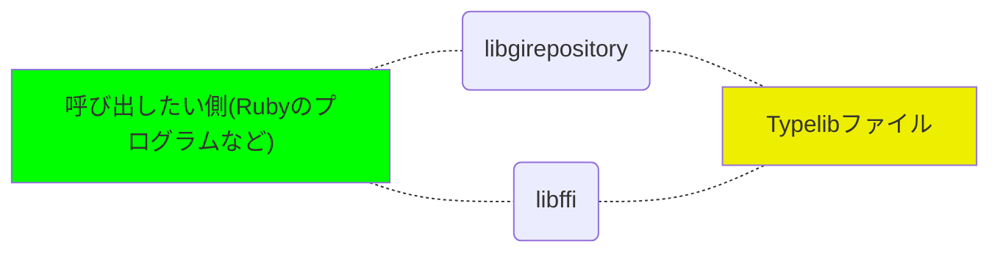

# Ruby-GNOMEチュートリアル

本ドキュメントは、これからRuby-GNOMEを開発する人のために、その仕組みと構造を概説したものです。


## Ruby-GNOMEとは

Ruby-GNOMEは、RubyからGNOMEライブラリを利用できるようにするライブラリです。Rubyの構文で、GNOMEライブラリを利用できます。


```
require "gtk3"
app = Gtk::Application.new("org.gtk.example", :flags_none)

app.signal_connect "activate" do |application|
  window = Gtk::ApplicationWindow.new(application)
  window.set_title("Window")
  window.set_default_size(200, 200)
  window.show_all
end

puts app.run
```


＠＠例は、適当にexampleから引っ張った。もっと短い簡単な例があるなら、そちらにしたい。またこの例は、可能なら、後ろの「GObject Introspectionを使ったGNOME関数呼び出しの例」の例とかに合わせた関数にするのが理想＠＠


## バインディングの作り方

GNOMEライブラリは、C言語で書かれています。すなわち、Ruby-GNOMEは、Ruby言語とC言語の橋渡しをするためのライブラリであり、こうしたライブラリは、俗に「バインディング」と呼ばれます。

バインディングの作り方は、主に、2通りあります。


（1）手動でマッピングする

ひとつめの方法は、対象言語（ここではC言語。以下同じ）の関数をRubyのメソッドにひとつずつ手動でマッピングしていく方法です。メリットは、わかりやすいことですが、ライブラリの関数の数がたくさんあるほど、作業量が増えてたいへんになります。


（2）自動生成する

もうひとつの方法は、関数の引数や戻り値の型情報を基に、自動で生成する方法です。自動化できるため、ライブラリの関数の数が多くても対応できます。反面、対象言語の慣例や型に合わせる必要があるため、ライブラリを呼び出すための記法が、Rubyらしくない書き方になりがちです。


Ruby-GNOMEは両者のメリットを採り入れ、自動生成したものに対して、いくつか手を加えることで、自動で作りつつも、Rubyらしい書き方でライブラリを呼び出せる記法を実現しています。


## GObject Introspection

GNOMEは、GObject（https://docs.gtk.org/gobject/）というライブラリを使って開発されています。このライブラリは、C言語でオブジェクト志向プログラミングをできるようにするものです。

GObjectは実行時に、オブジェクトのクラス名やメソッド名、プロパティ名、enumの値リストなどのメタデータを取得できるという特徴があります。この特徴を利用して、メタデータを取得することで、他の言語とGObjectを採用したライブラリとの橋渡しをするのが、GObject Introspection（https://gi.readthedocs.io/）というミドルレイヤーです。


### GObject Introspectionの仕組み

GObject Introspectionを使って、GObjectを採用したライブラリを他の言語から呼び出すには、ビルド時と実行時で、それぞれ、次のようにします。


（1）ビルド時

g-ir-scannerというコマンド（これはGObject Introspectionに含まれます。以下のコマンドも同様）を使ってメタデータを解析し、GIRと呼ばれるXML形式のファイルを作成します。このGIRファイルには、オブジェクトのクラス名、メソッド名、プロパティ名、enumの値リストなど、すべての型情報が含まれています。

XML形式のファイルをそのまま扱うと、パフォーマンスが悪いため、さらに、g-ir-compilerコマンドを使って、Typelibと呼ばれるバイナリ形式に変換します。


（2）実行時

実行時、すなわち、GObjectを採用したライブラリを呼び出したい側では、そのプログラムに「libgirepository」と「libffi」というライブラリを組み込みます。libgrepositoryがTypeLibを読み込んでメタデータを取得するライブラリ、libffiはその関数を呼び出すためのライブラリです。


【ビルド時】


【実行時】




### GObjectを採用したライブラリを別言語から利用するために必要なこと

この仕組みからわかるように、GObjectを採用したライブラリをRubyなどの別言語から利用するために必要なことは、次の通りです。


（1）TypeLibを作る

利用したいライブラリのTypeLibを用意します（GObjectを使っているC言語のライブラリはTypeLibを提供していますが、そうでない場合はg-ir-scannerコマンドおよびg-ir-compilerコマンドを使ってTypeLibファイルを作ります）。


（2）libgirrepositoryとlibffiを利用した呼び出しコードを書く

（1）のTypeLibファイルを読み込んで、関数を呼び出すコードを書きます。このコードには、libgirrepositoryとlibffiが必要です。


（2）の処理では、読み込んだTypeLibによって動的に関数が作られます。すなわち、利用するライブラリや関数によって処理を変える必要はありません。使いたいライブラリのTypeLibを作って入れ替えれば、（2）の処理を変更することなく汎用的に利用できます。


## Ruby-GNOMEにおけるGNOMEライブラリの呼び出し方

Ruby-GNOMEでは、いま説明したGObject Introspectionを利用して、GNOMEライブラリを呼び出しています。


### GObject Introspectionの部分

libgirrepositoryとlibffiを利用してTypeLibに書かれた関数を呼び出すための処理は、Ruby/GObjectIntrospectionにあります（https://github.com/ruby-gnome/ruby-gnome/tree/master/gobject-introspection）。


ここでは・・・・


みたいな解説を次回お願いしたい。


### TypeLibの作成

これで呼び出すための仕組みはできましたが、実際に呼び出すには、TypeLibが必要です。TypeLibは、・・・・のようにして作ります。


ToDo：TypeLibの作り方についての解説


### GObject Introspectionを使ったGNOME関数呼び出しの例

GObjectIntrospectionを使うと、次のようにしてGNOME関数を呼び出せます。


```
ここに実際に、ここまでの流れのひとつの関数の呼び出し例が欲しい
```


### Rubyらしく呼び出せるようにする

これでTypeLibさえあれば、Rubyから任意のC言語の関数が呼び出せるようになりました。しかしこうした呼び出しは、Rubyらしくありません。

先の例では、


```
hogehoge
```


と呼び出していましたが、もっとRubyらしく、


```
hugahuga
```


のように呼び出させるようにするのが理想でしょう。そこで引数の変換などをしてラップします。


ToDo：ラップする方法について詳しく解説


## Ruby-GNOMEライブラリの全体像と改良方法

このようにRuby-GNOMEライブラリは、GObject Introspection呼び出しをするための基本的なコードとなる「GObjectIntrospection」と、それぞれの関数をラップするクラスから構成されています。

呼び出したい関数を追加したり変更したりしたいときは、次のようにします。


（1）TypeLibを作る

ToDo：どうやってTypeLibを作って、どこに置くとかを記載


（2）ラップするクラスを作る・修正する

ToDo：ラップするクラスを作る・修正するとかの方法について簡単に記載


